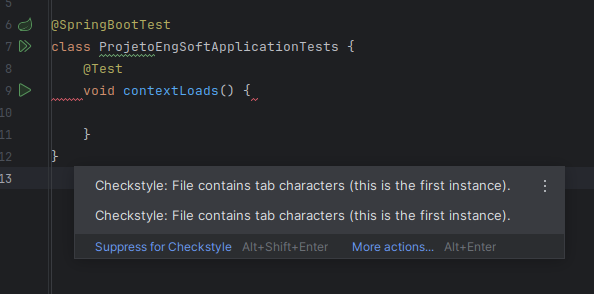
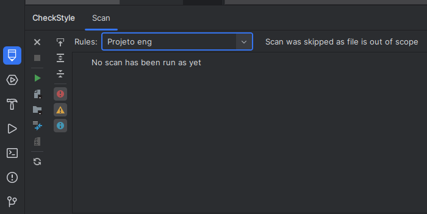

## CheckStyle

- Baixe o plugin no Intellij
- Entre no menu em _File -> Settings -> Editor -> Code Style_
- Na engrenagem, vá em _import scheme_ e depois clique em _Intellij IDEA Code Style XML_ para importar o arquivo _/config/IntelliJ Code Style.xml_.
- Para ativar as correções, entre no menu _File -> Settings -> Tools -> Checkstyle_ e importe o arquivo _config/checkstyle/checkstyle.xml_ ao clicar no botão [+]. 
  Ative a configuração clicando no _checklist_ e selecione o escopo para _Only Java sources (including tests)_.
  
- Além das inspeções em tempo real, também é possível verificar o projeto inteiro com a ferramenta na parte abaixo à esquerda.
